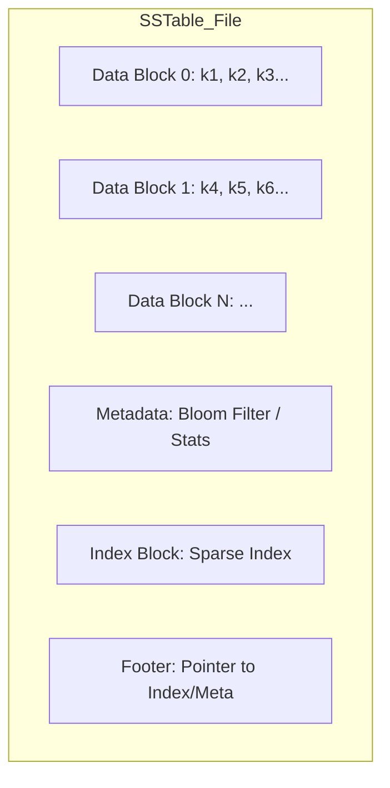

# TIL: Persistência em LSM-Trees — WAL e o Formato SSTable

Em sistemas LSM, a persistência é dividida em duas funções críticas: garantir que dados recentes não sejam perdidos em um *crash* (**WAL**) e organizar dados em massa de forma eficiente para leitura e compactação (**SSTables**).

## 1. Write-Ahead Log (WAL): O Seguro de Vida
Como a **Memtable** reside na RAM, um desligamento repentino causaria perda de dados. O WAL resolve isso registrando cada operação em disco antes de confirmar o sucesso para o cliente.

*   **Operação:** Append-only (sequencial). É extremamente rápido pois evita buscas no disco.
*   **Recuperação:** No boot, o banco lê o WAL do início ao fim e reconstrói a Memtable.
*   **Ciclo de Vida:** Assim que a Memtable sofre o *flush* para uma SSTable, o WAL correspondente pode ser deletado.

```text
[WAL Entry] -> CRC | Timestamp | Key Size | Value Size | Key | Value
[WAL Entry] -> CRC | Timestamp | Key Size | Value Size | Key | Value
(Escrita sequencial e determinística)
```

## 2. SSTable (Sorted String Table)
A SSTable é o formato de arquivo final. Sua principal característica é a **imutabilidade**. Uma vez escrita, ela nunca é alterada; novas versões de uma chave são escritas em novas SSTables.

### Estrutura Interna de uma SSTable (Layout Típico)
Para permitir buscas rápidas sem carregar o arquivo inteiro na RAM, o arquivo é dividido em blocos:



1.  **Data Blocks:** Pares chave-valor ordenados e geralmente comprimidos (Snappy/Zstd).
2.  **Index Block (Sparse Index):** Contém a última chave de cada bloco de dados e o offset de onde esse bloco começa no disco.
3.  **Footer:** Um bloco de tamanho fixo no final do arquivo que aponta para o início do índice. O banco lê o Footer primeiro.

---

## 3. O "Sparse Index" (Índice Esparso)
Ao contrário de um banco B-Tree que indexa cada chave, o LSM costuma usar um índice esparso para economizar RAM.

*   Se você busca a chave `K5` e o índice diz:
    *   `Bloco 0: Início na chave K1`
    *   `Bloco 1: Início na chave K8`
*   Você sabe que, se `K5` existir, ela **deve** estar no Bloco 0. Você faz o *seek* e lê apenas aquele bloco.

---

## 4. Implementação: Escrita de um Bloco (Pseudo-código)

Ao construir seu banco, você precisará de uma função que serialize os dados para o formato binário. Abaixo, um exemplo de como estruturar o *buffer* de um bloco de dados:

```go
// Exemplo conceitual de construção de um Data Block
type BlockBuilder struct {
    buffer     []byte
    offsets    []uint32
    entryCount int
}

func (b *BlockBuilder) Add(key []byte, value []byte) {
    // 1. Registrar o offset desta entrada para o índice do bloco
    b.offsets = append(b.offsets, uint32(len(b.buffer)))

    // 2. Escrever metadados da entrada (comprimentos)
    binary.Write(b.buffer, binary.LittleEndian, uint32(len(key)))
    binary.Write(b.buffer, binary.LittleEndian, uint32(len(value)))

    // 3. Escrever os dados reais
    b.buffer = append(b.buffer, key...)
    b.buffer = append(b.buffer, value...)
    
    b.entryCount++
}
```

---

## 5. Por que Append-only? (Mechanical Sympathy)
O design de SSTables aproveita o fato de que **I/O Sequencial** é ordens de magnitude mais rápido que **I/O Aleatório**, tanto em HDDs quanto em SSDs (devido ao funcionamento do FTL - Flash Translation Layer).

| Tipo de I/O | HDD (SATA) | SSD (NVMe) |
| :--- | :--- | :--- |
| **Aleatório** | ~0.1 - 0.5 MB/s | ~50 - 100 MB/s |
| **Sequencial** | ~100 - 200 MB/s | ~2000 - 5000 MB/s |

---

## 6. Referências e Pesquisa Adicional

### Livros
*   **Petrov, Alex. "Database Internals" (Capítulo 4: Storage Engines)**: Detalha o layout de arquivos binários, alinhamento de blocos e checksums.
*   **Goetz, Brian. "Java Concurrency in Practice"**: (Útil para entender a segurança na persistência e flush de buffers).

### Papers e Artigos
*   **Bigtable: A Distributed Storage System for Structured Data (Google, 2006)**: Introduziu o conceito moderno de SSTables e como elas são usadas em escala.
*   **Fsync() is not enough**: Artigo técnico sobre as dificuldades de garantir que o dado realmente tocou o disco (barrier issues).
*   **LevelDB Table Format**: A especificação do Google para o formato `.ldb`, uma das referências mais limpas para implementar sua própria SSTable.

---
**Tags:** #Databases #SSTable #WAL #Persistence #StorageEngine #TIL
