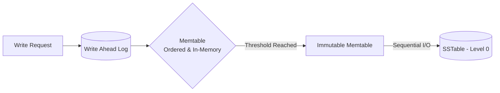

# TIL: Memtable Management & SkipLists em LSM-Trees

Em bancos de dados baseados em **LSM-Tree (Log-Structured Merge-Tree)**, a **Memtable** é a estrutura de dados em memória que recebe todas as escritas antes de serem persistidas em disco como SSTables.

## 1. O Fluxo da Escrita
Quando um dado chega, o fluxo típico é:
1.  **WAL (Write-Ahead Log):** O dado é anexado a um log sequencial no disco (durabilidade).
2.  **Memtable:** O dado é inserido em uma estrutura ordenada em memória.
3.  **Flush:** Quando a Memtable atinge um limite (ex: 64MB), ela se torna imutável e é escrita no disco como uma **SSTable**.



## 2. Por que SkipLists?
Embora Árvores Red-Black ou AVL garantam tempo $O(\log n)$, a maioria das implementações de LSM (LevelDB, RocksDB, WiredTiger) utiliza **SkipLists**.

### Vantagens técnicas:
*   **Concorrência sem travas (Lock-free):** Implementar algoritmos de rebalanceamento de árvores (como rotações em RB-Trees) de forma thread-safe é extremamente complexo. SkipLists podem ser implementadas usando apenas operações `CAS` (Compare-and-Swap).
*   **Simplicidade:** O código de uma SkipList é significativamente menor e menos propenso a bugs do que uma árvore auto-balanceada.
*   **Iteração eficiente:** Assim como as árvores, elas mantêm os dados ordenados, permitindo scans de range ($O(\log n) + k$).

### Comparativo de Complexidade
| Operação | SkipList (Médio) | Árvore B+ | Red-Black Tree |
| :--- | :--- | :--- | :--- |
| **Busca** | $O(\log n)$ | $O(\log n)$ | $O(\log n)$ |
| **Inserção** | $O(\log n)$ | $O(\log n)$ | $O(\log n)$ |
| **Implementação** | Fácil | Difícil | Muito Difícil |
| **Lock-free** | Nativo/Simples | Complexo | Extremamente Complexo |

---

## 3. Anatomia de uma SkipList (Exemplo em Go-style)

A SkipList funciona através de camadas. A camada base contém todos os elementos, e camadas superiores "pulam" elementos para acelerar a busca.

```go
type Node struct {
    key   []byte
    value []byte
    next  []*Node // Array de ponteiros para os próximos nós em cada nível
}

type SkipList struct {
    head   *Node
    height int // Nível máximo atual
}
```

### Visualização da Estrutura
```text
L3: Head ----------------------> [20] ----------------------> NIL
L2: Head ----------> [10] ------> [20] ----------> [35] ------> NIL
L1: Head --> [5] --> [10] --> [15] --> [20] --> [25] --> [35] --> NIL
```

Ao buscar a chave `25`, o algoritmo começa no `L3`, pula para `20`, desce para `L2`, desce para `L1` e encontra o `25`.

---

## 4. Implementação de Inserção (Pseudocódigo Técnico)

A altura de um novo nó é definida probabilisticamente (como jogar uma moeda).

```python
def insert(key, value):
    # 1. Encontrar a posição de inserção em cada nível
    update_nodes = find_predecessors(key)
    
    # 2. Gerar altura aleatória (ex: p=0.5)
    new_height = random_height()
    
    # 3. Criar novo nó e atualizar ponteiros (usando CAS se for lock-free)
    new_node = Node(key, value, new_height)
    for i in range(new_height):
        new_node.next[i] = update_nodes[i].next[i]
        update_nodes[i].next[i] = new_node
```

---

## 5. Referências e Pesquisa Adicional

### Livros
*   **Petrov, Alex. "Database Internals" (Chapter 3: LSM-Trees)**: A bíblia moderna sobre o funcionamento interno de bancos de dados. Explica detalhadamente o tradeoff entre Memtables e SSTables.
*   **Kleppmann, Martin. "Designing Data-Intensive Applications" (Chapter 3: Storage and Retrieval)**: Excelente visão panorâmica de como o LSM se compara ao B-Tree.

### Artigos e Papers
*   **The Log-Structured Merge-Tree (LSM-Tree)** (O'Neil et al., 1996): O paper original que definiu o conceito.
*   **LevelDB Implementation Notes**: Documentação oficial do Google sobre como eles utilizam SkipLists na Memtable.
*   **Pugh, William. "Skip Lists: A Probabilistic Alternative to Balanced Trees" (1990)**: O paper original que introduziu as SkipLists.

---
**Tags:** #Databases #LSMTree #SkipList #DataStructures #BackEnd #TIL
