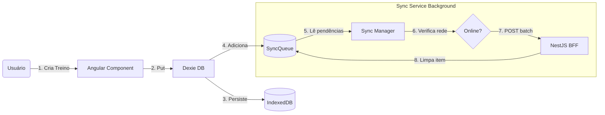

# 📘 Documento de Arquitetura Frontend: Workout PWA

**Versão:** 1.0 (Draft)  
**Autor:** Elio Neto (via Assistant)  
**Status:** Planejamento  
**Data:** 04/02/2026  

---

## 1. Visão Geral e Objetivos

O objetivo é desenvolver uma aplicação **Progressive Web App (PWA)** para gerenciamento de treinos de musculação. A aplicação deve oferecer uma experiência nativa, com foco absoluto em usabilidade mobile e disponibilidade offline.

### Princípios Fundamentais
1. **Offline-First:** A aplicação deve ser totalmente funcional sem internet. O banco de dados local é a "Fonte da Verdade" imediata.  
2. **Optimistic UI:** As ações do usuário (salvar, deletar) refletem instantaneamente na interface, enquanto a sincronização ocorre em segundo plano.  
3. **Mobile-First:** Design responsivo focado em telas de toque (touch targets grandes, navegação por abas/gestos).  

---

## 2. Stack Tecnológica

| Componente | Tecnologia | Justificativa |
| :--- | :--- | :--- |
| **Framework** | **Angular 17+** | Robustez, tipagem forte, injeção de dependência e arquitetura *Standalone Components*. |
| **Linguagem** | **TypeScript 5+** | Segurança de tipos, essencial para compartilhar interfaces com o Backend. |
| **Banco Local** | **Dexie.js** | Wrapper leve e tipado para o **IndexedDB**. Facilita consultas complexas no browser. |
| **Estado** | **Angular Signals** | Gerenciamento de reatividade granular e performático (sem necessidade de NgRx para o MVP). |
| **HTTP Client** | **Angular HttpClient** | Integração nativa com RxJS para chamadas à API (Sync). |
| **Estilização** | **SCSS + TailwindCSS** | Produtividade na criação de layouts responsivos e utilitários. |
| **PWA** | **@angular/pwa** | Service Workers para cache de assets e instalação na Homescreen. |
| **Ícones** | **Phosphor Icons / Material** | Ícones vetoriais leves. |

---

## 3. Arquitetura de Dados (Core Offline)

Esta é a parte mais crítica do sistema. O frontend não consome dados da API para exibir na tela; ele consome do IndexedDB. A API serve apenas para backup e sincronização.

### 3.1. Modelo de Dados (Schema Dexie)

```typescript
// db/app-db.ts

export interface SyncQueueItem {
  id?: number; // Auto-increment
  action: 'CREATE' | 'UPDATE' | 'DELETE';
  entity: 'WORKOUT' | 'EXERCISE' | 'LOG';
  entityId: string; // UUID
  payload: any; // O dado completo ou parcial
  timestamp: number;
}

export class AppDB extends Dexie {
  exercises!: Table<Exercise, string>;
  workouts!: Table<Workout, string>;
  logs!: Table<WorkoutLog, string>;
  syncQueue!: Table<SyncQueueItem, number>;

  constructor() {
    super('WorkoutPWA_DB');
    this.version(1).stores({
      exercises: 'id, name, muscleGroup, updatedAt', // Indexes
      workouts: 'id, userId, title, updatedAt',
      logs: 'id, workoutId, date, updatedAt',
      syncQueue: '++id, timestamp' // Fila ordenada por tempo
    });
  }
}
```

### 3.2. Geração de IDs

Como os dados são criados offline, **o Frontend é responsável por gerar os IDs**.  
- Utilizaremos **UUID v4** para todas as entidades (`uuid` package).  
- Isso evita conflitos de ID quando o dado chegar ao Backend/Rust DB.  

---

## 4. Estrutura do Projeto (Scaffolding)

A estrutura seguirá o padrão moderno de **Standalone Components** do Angular (sem NgModules excessivos), organizado por *Features*.

```text
src/
├── app/
│   ├── core/                    # Singletons e lógica global
│   │   ├── services/
│   │   │   ├── auth.service.ts  # JWT e Login
│   │   │   ├── sync.service.ts  # Orquestrador da Sincronização
│   │   │   ├── network.service.ts # Monitoramento Online/Offline
│   │   │   └── db.service.ts    # Instância do Dexie
│   │   ├── guards/              # Proteção de rotas (AuthGuard)
│   │   ├── interceptors/        # Token JWT nas requests
│   │   └── models/              # Interfaces Globais (DTOs)
│   │
│   ├── shared/                  # Componentes reutilizáveis
│   │   ├── components/
│   │   │   ├── button/
│   │   │   ├── card/
│   │   │   └── layout/          # Header, BottomNav
│   │   ├── pipes/
│   │   └── directives/
│   │
│   ├── features/                # Domínios da aplicação
│   │   ├── auth/                # Login, Cadastro
│   │   ├── exercises/           # Lista, Detalhe, Form
│   │   ├── workouts/            # Montagem de ficha
│   │   ├── tracker/             # Execução do treino (cronômetro, inputs)
│   │   └── profile/             # Configurações e Histórico
│   │
│   ├── app.routes.ts            # Lazy Loading das features
│   └── app.component.ts         # Root
│
├── assets/                      # Imagens, ícones, manifest.webmanifest
├── styles/                      # Variáveis SCSS, Tailwind config
└── environments/                # Configs de API (Dev/Prod)
```

---

## 5. Fluxos de Dados e Sincronização

Diagrama lógico de como o dado flui:



### 5.1. Escrita (Create/Update/Delete)

1. Componente chama `WorkoutService.save(workout)`.  
2. Service gera UUID e Timestamp.  
3. Service salva no Dexie `workouts` (UI atualiza via Signal).  
4. Service salva uma entrada na Dexie `syncQueue` com a ação.  

### 5.2. Sincronização (Push - Envio)

- Acionado por: Retorno da conexão (evento `window:online`) ou Botão manual "Sincronizar".  
- O `SyncService` lê a tabela `syncQueue`, agrupa os itens e envia um JSON para o Backend (`POST /api/sync/push`).  
- Se sucesso: deleta os itens da `syncQueue`.  

### 5.3. Sincronização (Pull - Recebimento)

- O `SyncService` pede ao backend: `GET /api/sync/pull?lastSync={timestamp_local}`.  
- Backend retorna array de objetos atualizados.  
- Frontend iterativamente faz `db.table.put()` nesses objetos, atualizando o banco local.  

---

## 6. Camada de UI/UX (Design System Básico)

### Layout

- **Mobile:** Navegação inferior (Bottom Navigation Bar) com ícones: *Treinar, Fichas, Perfil*.  
- **Desktop:** Sidebar lateral (embora o foco seja mobile).  

### Componentes Chave

1. **Input de Série:** Componente numérico grande para fácil digitação de Peso e Repetições.  
2. **Cronômetro Flutuante:** Overlay persistente durante o treino.  
3. **Lista Virtual (Virtual Scroll):** Se a lista de exercícios for grande, usar o `@angular/cdk/scrolling` para performance.  

---

## 7. Segurança

1. **Armazenamento de Token:** O JWT retornado pelo NestJS será armazenado de forma segura (HttpOnly Cookie preferencialmente, ou `secure localStorage` como fallback para o MVP PWA).  
2. **HTTPS:** Obrigatório para que o Service Worker funcione.  
3. **Sanitização:** Angular já sanitiza inputs por padrão contra XSS.  

---

## 8. Estratégia de Build e Deploy

### Build

- `ng build --configuration production`  
- O Angular CLI gera os arquivos estáticos na pasta `dist/`.  

### Hosting (Frontend)

- **Opções:** Firebase Hosting, Vercel, Netlify ou Cloudflare Pages.  
- **Requisito:** Deve servir os arquivos estáticos e suportar redirecionamento de rotas (SPA fallback to index.html).  

---

## 9. Próximos Passos (Refinamento)

Para transformar este documento em código, a ordem sugerida de implementação é:

1. **Configuração Inicial:** `ng new`, setup do Tailwind e PWA.  
2. **Database Layer:** Implementar `AppDB` (Dexie) e `DbService`.  
3. **Feature "Exercícios":** CRUD completo funcionando apenas com Dexie.  
4. **Feature "Treinos":** Relacionamento entre Treino e Exercícios.  
5. **Sync Layer:** Implementar a lógica de Fila e integração com o BFF NestJS.  
