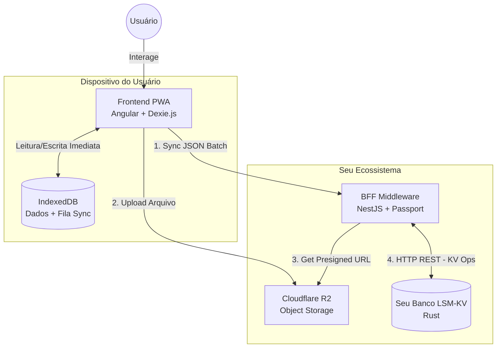

### 🏛️ 1. Visão Geral da Arquitetura

*   **Modelo:** Offline-First PWA.
*   **Fluxo de Dados:** Unidirecional e Cíclico (Store -> Queue -> Sync).
*   **Princípio:** O Backend (NestJS) confia cegamente na consistência do Banco (Rust).

---

### 🛠️ 2. Stack Tecnológica Definida

| Camada | Tecnologia | Responsabilidade Principal |
| :--- | :--- | :--- |
| **Banco de Dados** | **Rust (Custom LSM)** | Motor de armazenamento de alta performance, *append-only*, imutável. Garante a "verdade" dos dados. |
| **Backend (BFF)** | **Node.js (NestJS)** | Autenticação (JWT), Orquestração de Sync, Geração de URLs assinadas (R2), Adapter para o banco. |
| **Frontend** | **Angular (v17+)** | UI/UX, Lógica Offline, Gerenciamento de Estado Local. |
| **Local DB** | **Dexie.js** | Persistência no navegador (IndexedDB) e Fila de Sincronização. |
| **Storage** | **Cloudflare R2** | Armazenamento barato/gratuito de imagens e vídeos dos exercícios. |

---

### 📋 3. Estratégia de Dados & Sincronização

#### Design de Chaves (Key Design)
Para aproveitar o `scan_prefix` do seu banco, as chaves seguirão uma hierarquia lógica.
*   **Formato:** `entidade:user_id:id_unico:timestamp`
*   **Exemplo:** `workout:u55:w999:1764532000`

#### O Fluxo de Sync (Store, Queue, Sync)
1.  **Offline/Local:** O usuário cria um treino. Angular salva no Dexie e adiciona à fila `SyncQueue` (`status: pending`).
2.  **Trigger:** O `NetworkService` detecta conexão ou usuário força atualização.
3.  **Push (Envio):** Angular pega a fila, monta um `JSON Array` e manda para `POST /api/sync`.
4.  **Processamento:** NestJS recebe, transforma em pares KV e manda para `POST /keys/batch` no Rust.
5.  **Confirmação:** Sucesso 200 OK -> Angular limpa a fila.
6.  **Pull (Recebimento):** Angular pede "mudanças desde timestamp X". NestJS consulta `GET /keys/search/prefix` no Rust e retorna o estado atualizado.

---

### 📅 4. Roadmap de Execução (Passo a Passo)

#### **Fase 1: O Motor (Banco Rust - Alpha)**
*   [x] Estrutura básica (Memtable, WAL, SST).
*   [x] API REST (`put`, `get`, `scan`).
*   [ ] **Crítico:** Otimizar a função `search_prefix` para filtrar durante a leitura (não carregar tudo na RAM).
*   [ ] **Crítico:** Garantir que o retorno do banco já venha "limpo" (sem deletados, apenas a última versão).

#### **Fase 2: O Adaptador (NestJS)**
*   [ ] Setup do projeto NestJS.
*   [ ] Módulo de Autenticação (Login/Cadastro gerando JWT).
*   [ ] **Service do Banco:** Criar a classe que faz requisições HTTP para o Rust (`Axios`).
*   [ ] **Service do Storage:** Integração com AWS SDK (para Cloudflare R2) para gerar *Presigned URLs*.
*   [ ] Endpoint de Teste: Criar um dado via Postman -> NestJS -> Rust DB.

#### **Fase 3: A Interface (Angular PWA)**
*   [ ] Setup Angular + PWA + Dexie.js.
*   [ ] Modelagem das tabelas locais (`Workouts`, `Exercises`, `SyncQueue`).
*   [ ] `NetworkService`: Monitorar status online/offline.
*   [ ] Telas básicas: CRUD de Exercícios (funcionando 100% offline).

#### **Fase 4: A Integração Final**
*   [ ] Implementar o "Sync Manager" no Angular (consumir fila e enviar pro NestJS).
*   [ ] Implementar o Upload de Imagem (Angular pede URL pro Nest -> Sobe pro R2 -> Salva link no objeto).
*   [ ] Teste de "Modo Avião": Usar o app, desligar net, ligar net, verificar se os dados chegaram no banco Rust.

---

### ⚠️ Pontos de Atenção (Checklist de Riscos)

1.  **Performance do `scan` no Rust:** Como conversamos, se não otimizar o filtro de prefixo para ocorrer *antes* de carregar o HashMap, o banco vai engasgar com muitos dados. Esse é o ponto mais crítico do sistema.
2.  **Conflitos de Edição:** No modelo "Last Write Wins" (baseado em timestamp), se dois dispositivos editarem o mesmo treino ao mesmo tempo, o último relógio vence. Para um MVP, isso é aceitável.
3.  **Segurança do Banco:** O banco Rust **não deve** ficar exposto para a internet pública. Ele deve rodar em uma rede privada (ex: Docker Network) acessível apenas pelo container do NestJS.

**Conclusão:** O plano está sólido, moderno e tecnicamente desafiador na medida certa (construir o próprio banco é um aprendizado enorme). A separação em camadas garante que seu frontend e backend de negócio sobrevivam mesmo que você decida reescrever o banco inteiro do zero no futuro.

Mãos à obra! 🚀
